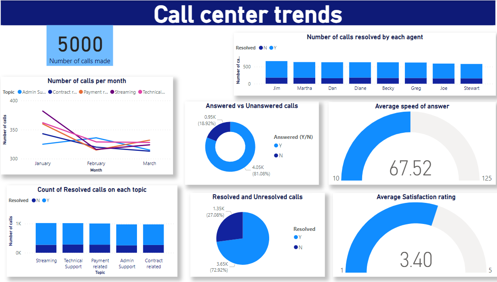

# Call center trends (Power BI Project)

## Introduction
This is a power bi project on Call center trends of a Telecom company.This project is to analyze and derive insights for a client to make data driven decisions by providing well designed Power BI dashboard visualising the necessary KPIs and metrics.

**_Disclaimer_**  :  _The dataset was provided by PwC company during the job simulation program that l participated in._

## Problem statement
1.	What are the Long Term trends in customer and adgent behaviour?
   

## Skills/concepts demonstrated
The following Power BI features were incorporated:
-	quick measures,
-	filters,
-	gauge,line charts,bar charts and cards.

## Visualization
The report comprises of 1 page
1.	Trends

You can interact with the report [here](https://app.fabric.microsoft.com/groups/me/reports/dd689d7a-6898-42d3-abb2-92f550ee5915/ReportSection?experience=power-bi)

## Analysis:

           

From the dashboard we can see that from the 5000 customers contacted 81 % answered and 72 % of the answered calls were resolved.This led to a customer satisfaction of 3.4 which is not bad but there is room for improvement.Jim received more calls compared to the others,Jim and Diane have the same number of unresolved calls and Jim compared to all has more resolved cases too.Contract ,payment,streaming and technical support related calls decreased in the month of January and slightly increased as the month of February was starting.But for Admin support calls it was vice-versa.

## Conclusion and Recommendation

The customer satisfaction rate is okay but can be improved by offering training to call adgents to equip them with necessary skills and knowledge in handling customer inquiries.
The company can invest in customer relationship management (CRM) systems so as to improve efficiency, and enhance the overall customer experience.
